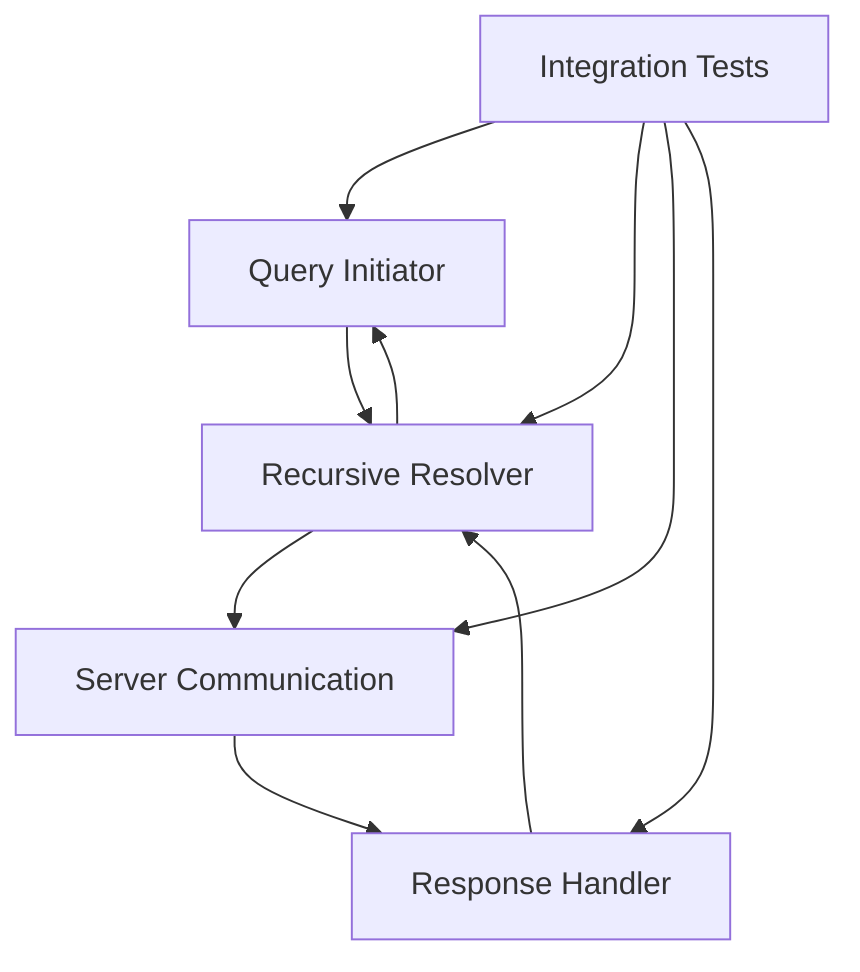

# CS348-Final-Project

# Recursive DNS Resolver - Team Structure and Organization

## Query Initiator & Client Interface

- Implement the initial query handling from client
- Create the interface for receiving DNS requests
- Handle initial communication with local DNS server
- Manage response back to requesting client

**Key Deliverables:**
- QueryInitiator.java
- ClientInterface.java
- Unit tests for query initiation

## Recursive Resolution Logic

- Implement the core recursive resolution logic
- Handle the step-by-step resolution process
- Manage the sequence of queries to different DNS servers
- Track the resolution chain

**Key Deliverables:**
- RecursiveResolver.java
- ResolutionChain.java
- Unit tests for recursive logic

## Server Communication

- Handle communication with different DNS servers
- Implement connections to root DNS servers
- Manage TLD server communications
- Handle authoritative server interactions

**Key Deliverables:**
- ServerCommunication.java
- DNSServerConnector.java
- Connection tests

## Response Handler

- Process responses from each DNS server
- Handle intermediate responses in the recursive chain
- Manage final response compilation
- Implement error handling for failed queries

**Key Deliverables:**
- ResponseHandler.java
- ResponseProcessor.java
- Error handling tests

## Integration Lead
**Responsibilities:**
- Coordinate between all components
- Ensure proper flow of recursive resolution
- Handle timing and timeouts
- Manage overall testing
- Integration testing

**Key Deliverables:**
- Integration tests
- System flow tests
- Performance tests

## System Flow

## Integration Points
- Query Initiator → Recursive Resolver: Pass initial query
- Recursive Resolver → Server Communication: Server queries
- Server Communication → Response Handler: Process responses
- Response Handler → Recursive Resolver: Continue or complete resolution
- Recursive Resolver → Query Initiator: Final response
